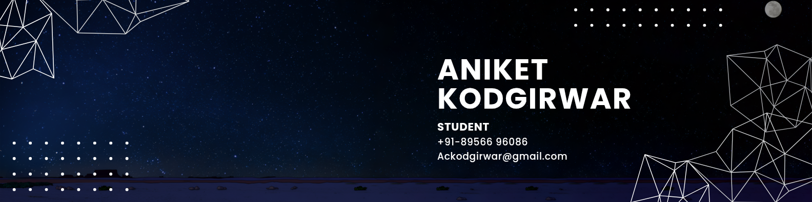

<h1 align="left">Hi! I'm Aniket Kodgirwar</h1>

###

<h2 align="left">About me</h2>

###

A student exploring the world of programming and cybersecurity. 🚀  -Currently learning the basics of C, C++, data structures and algorithms, and cybersecurity 🌱 -Building my foundation in this field with development and security 💻 -One bug at a time, exploring new tech 🔍

###

<h2 align="left">I code with</h2>

###

  
  
  
  
  
  
  

###

<h2 align="left">Other skills</h2>

###

  
  
  

###

<h2 align="left">Socials</h2>

###

  
  
  

###

<h2 align="left">Never stop learning because life never stops teaching.✨</h2>

###
